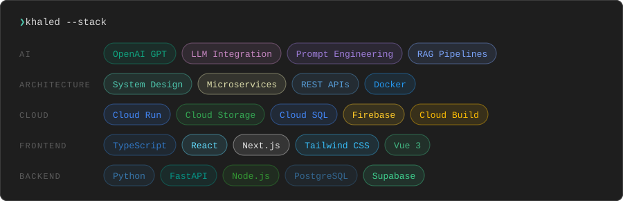

  

 

  <a href="https://www.khal1dx.com"><b>portfolio</b></a>
  &nbsp;·&nbsp;
  <a href="https://linkedin.com/in/khal1dx">linkedin</a>
  &nbsp;·&nbsp;
  <a href="mailto:khaledmohamedsalleh@gmail.com">email</a>

---

### whoami

Software engineer and AI developer in Cairo, currently finishing a Computer Engineering degree at the German University in Cairo with a semester spent in Berlin.

Most of my work sits on the seam between product code and language models: the unglamorous plumbing that turns a good demo into something that survives real users, real files, and real edge cases. I build across the stack, React and Next.js on the front, Python and FastAPI behind it, deployed on Google Cloud.

Before any of that I ran **Innovisionary Creative**, a video and brand studio I started as a teenager. That is why I care what things look like, not just whether they run.

### currently building

**Agile Translate** localizes PowerPoint decks from English to Arabic and rewrites the layout from LTR to RTL without breaking the design. The interesting part is not the translation, it is that a deck is a pile of absolutely positioned XML, so every shape, text box, and alignment has to be mirrored deliberately. Next.js and FastAPI, OpenAI GPT driving the translation, direct PPTX/OOXML editing underneath, running on Cloud Run, Cloud Storage, and Cloud SQL behind Firebase Auth. Built with the team at Agile Worx.

### selected work

| project | what it is |
| :-- | :-- |
| **[Agile Translate&nbsp;↗](https://www.theagileworx.com/products/slideworx)** | AI PowerPoint localization, English to Arabic with full RTL layout transformation. |
| **[Deema&nbsp;↗](https://deema.khal1dx.com)** | Bilingual habit tracker built around Islamic worship. Logs on sliders instead of checkboxes, so a hard day still counts for what it was. |
| **[dev-mode portfolio&nbsp;↗](https://www.khal1dx.com)** | My portfolio, built as a working VS Code window. File tree, command palette, real terminal. |
| **[Cross-Modal Cartographer](https://github.com/kha1dx/cross-modal-cartographer)** | Bachelor thesis. Neuro-symbolic sketch and text retrieval for Egyptian cultural landmarks. |
| **[Innovisionary Creative&nbsp;↗](https://innovisionary.khal1dx.com)** | The studio I founded. Brand identity, video, and motion work, on a site I designed and built. |
| **[SCAD&nbsp;↗](https://scad.khal1dx.com)** | University internship portal with application tracking and company matching. |

### stack

### elsewhere

Shipped the Network Inspector for the DATEX Workbench at **[unyt.org](https://unyt.org)** in Vue 3, giving developers real-time visibility into network traffic from inside the IDE. Graduate of the McKinsey Forward Program.

 

  Open to interesting problems. <a href="mailto:khaledmohamedsalleh@gmail.com">Say hi</a>.

